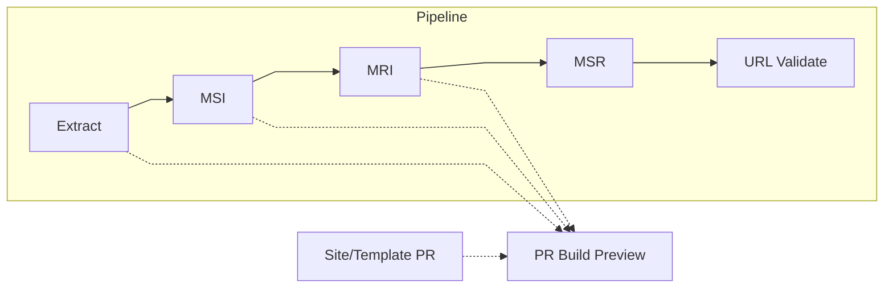

# MSRBot.io
Automated cross-publisher standards index 
_built and maintained by [Steve LLamb](https://github.com/SteveLLamb)_

[](https://github.com/PrZ3/MSRBot.io/actions/workflows/extract-docs.yml)
[](https://github.com/PrZ3/MSRBot.io/actions/workflows/build-master-reference-index.yml)
[](https://github.com/PrZ3/MSRBot.io/actions/workflows/build-master-suite-index.yml)
[](https://github.com/PrZ3/MSRBot.io/actions/workflows/build-msr-site.yml)
[](https://github.com/PrZ3/MSRBot.io/actions/workflows/validate-urls.yml)
[](https://github.com/SteveLLamb/MSRBot.io/actions/workflows/pr-build-preview.yml)

## Why It Exists
[MSRBot.io](https://msrbot.io/) is a live, automated (and hand curated) Media Standards Registry (MSR) of media technology documents — extracting, validating, and linking documents across [SMPTE](https://www.smpte.org/), [ISO](https://www.iso.org/home.html), [ITU](https://www.itu.int/), [AES](https://aes2.org/) and other many other publishers, SDOs, and industry groups. 

MSRBot.io began in 2020 as a response to a long-standing gap in how the media and entertainment industry tracks its own standards, best practices, specifications, and other important documents and publications - and the references contained within. Understanding the tangled tree branches and roots of documents' dependencies due to the nature of nested references (sometimes circular, and often cross-org), was required for regular maintanance of these critically important documents. 

Documents from [SMPTE](https://www.smpte.org/), [ISO](https://www.iso.org/home.html), [ITU](https://www.itu.int/), [AES](https://aes2.org/) and others have always been interconnected — yet their references lived scattered across the internet as generated or scanned PDFs, HTML pages, TXT files, sometimes hidden behind paywalls, or trapped in inconsistent formats. MSRBot.io was built to solve that: an open, automated registry that maps those relationships, extracts structured metadata, and preserves a living history of the standards ecosystem. 

What started as a personal tool to make sense of reference trees has grown into a self-maintaining system that reveals the lineage, dependencies, and context of the world’s media technology documents

> See [docs/changelog.md](docs/changelog.md) for details on updates since Q2 2025.

### Live Stats

[](https://msrbot.io/api/viewer.html?path=documents.total)
[](https://msrbot.io/api/viewer.html?path=documents.active)
[](https://msrbot.io/api/viewer.html?path=documents.docTypes)
[](https://msrbot.io/api/viewer.html?path=documents.references)
[](https://msrbot.io/api/viewer.html?path=documents.publishers)

> _All badges are generated from live JSON at [api/stats.json](https://msrbot.io/api/stats.json)._

#### Details
- **Historical range:** 1896 → present  
- **Automation uptime:** 100% since August 2025 (SMPTE)
- **Publishers covered:** SMPTE, NIST, ISO, ITU, AES, and more

### Key Artifacts
- Core data stored as JSON: [`src/main/data`](src/main/data/)
- Schema for data: [`src/main/schemas`](src/main/schemas/)
- Main document Dataset: [`documents.json`](src/main/data/documents.json)
- Document lineages: [Master Suite Index (MSI)](src/main/reports/masterSuiteIndex.json)
- Document reference maps: [Master Reference Index (MRI)](src/main/reports/masterReferenceIndex.json)
- Live API Stats [api/stats.json](https://msrbot.io/api/stats.json)
- Public Site generated from `main` at <https://msrbot.io>

## Automation Overview
MSRBot.io updates itself through a chain of automated GitHub Actions. When appropriate, PRs generate MSR Build Preview review links. 

> See [`docs/samples.md`](docs/samples.md) for full workflow details and live run sample links.

| Stage | Purpose | Trigger | Key Output |
|:------|:---------|:---------|:------------|
| Extract | Pulls and parses SMPTE HTML/PDF metadata | Weekly | `documents.json` |
| MSI | Builds document lineages | PR Merge/Weekly | `masterSuiteIndex.json` |
| MRI | Maps references across all docs | After MSI | `masterReferenceIndex.json` |
| MSR | Builds and publishes the site | After MRI | <https://msrbot.io/> |
| URL Validate | Checks and normalizes links | After MSR | `url_validate_audit.json` |
| PR Build Preview| Builds MSR preview prior to publication | PR Creation (Extract/MSI/MRI/Site PRs) | <https://msrbot.io/pr/###/> |


_Dotted lines indicate PR-triggered preview builds. Extract, MSI, MRI, and site/template PRs all generate a preview._

### Development
Requires Node 20 + npm.  
Run scripts with:
```bash
npm run extract
npm run build-msi
npm run build-mri
npm run validate-urls
npm run normalize-urls
npm run canonicalize
npm run validate
npm run build
```
---
### Contributing
Issues and pull requests are welcome.  
For questions or collaboration inquiries, contact [Steve LLamb](https://github.com/SteveLLamb).